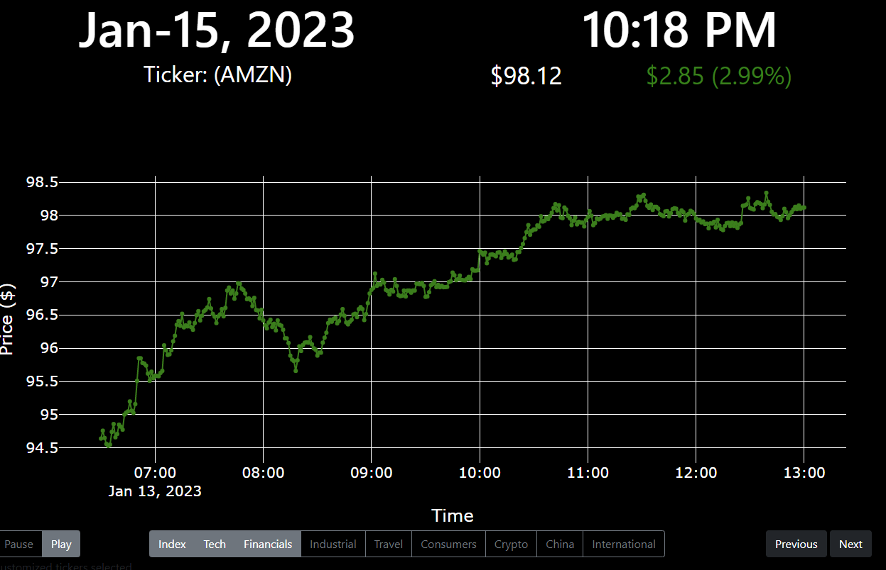

# stockticker
Plotly based Stock Ticker dashboard

Do you have an extra screen or an obsolete tablet that is too slow for everyday use? This Stock Ticker dashboard can 
bring new life in your devices by enabling it to track stock prices and crypto prices.

Best way to run this application:
1) Run stockticker.py on a local network device
2) enable the stockticker.py to run on server mode:
   1) replace
      1) >app.run_server(debug=True)
   2) with the specific IP address of the hosting server
      1) > app.server.run(port=8000, host='xxx.xxx.x.xxx')
3) To access the stock ticker dashboard, open a browers to the designated address
   1) > xxx.xxx.x.xxx:8000

If the user operates the dashboard from a development or debug mode, the dashboard can be access via the following address: 127.0.0.0:8050.

Result, scrolling stock ticker website:

Customization:
1) Tickers could be modified via the ticker.csv file
2) Tickers scroll through automatically every 5 seconds (will be adjustable later)
3) Buttons provide additional control
   1) Play/Pause - enables or disable auto ticker scrolling
   2) All Stock/Crypto - changes scrolling bank of ticker to include crypto or exclusively on crypto (more features coming)
   3) Next - skip to the next ticker in the queue
   4) Previous - skip to the previous ticker in the queue
4) Stock price alert options features to be added later 
