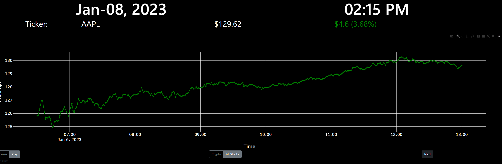

# stockticker
Plotly Based Stock Ticker

Have an extra screen, or an old tablet that is too slow for normal use? turn it into a stock ticker!

Run the following file:
python stockticker.py

access the predetermined server site: 127.0.0.0:8050
This could be changed according to the ip address if required.

Result, scrolling stock ticker website:

